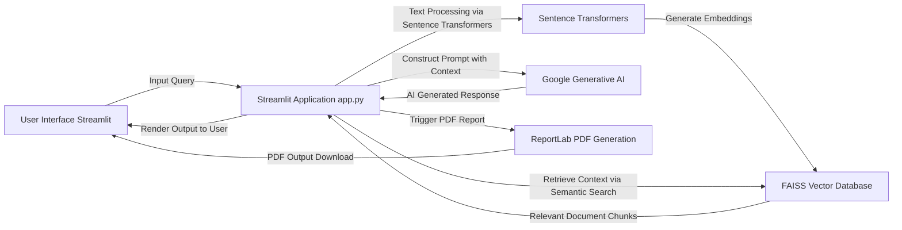
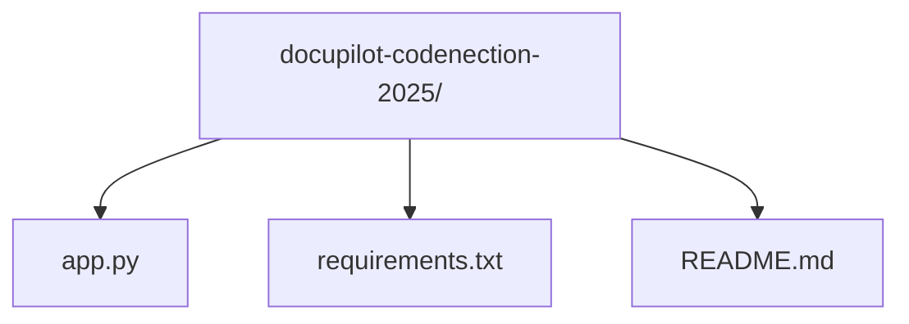

# Documentation for Docupilot

**Team Name:** Vibe Coder

**Team Members**:
1. Muhammad Izzhan Hakimi bin Mohd Izzmir
2. Nazrul Ikram bin Nazarulanuar
3. Iskandar Hakim bin Burhanuddin
4. Wan Muhammad Afiq Zafry bin Wan Burahanudin

**Track:** Industry Collaboration

**Problem Statement:** Fix the Docs: Smarter, Faster, Maintainable Documentation for the Real World by iFAST

This document provides comprehensive technical documentation for the `Docupilot` project. It covers the project's purpose, architecture, setup instructions, usage, and key components.

**This documentation was created using `Docupilot`, and was reviewed by humans.**

---

## Table of Contents

1.  [Introduction](#1-introduction)
2.  [Features](#2-features)
3.  [Architecture](#3-architecture)
4.  [Setup and Installation](#4-setup-and-installation)
    *   [Prerequisites](#prerequisites)
    *   [Cloning the Repository](#cloning-the-repository)
    *   [Setting up the Environment](#setting-up-the-environment)
    *   [Installing Dependencies](#installing-dependencies)
    *   [Environment Variables](#environment-variables)
    *   [Running the Application](#running-the-application)
5.  [Usage](#5-usage)
6.  [Project Structure](#6-project-structure)
7.  [Dependencies](#7-dependencies)
8.  [Troubleshooting](#8-troubleshooting)
9.  [Contributing](#9-contributing)
10. [License](#10-license)

---

## 1. Introduction

The `Docupilot` project is an innovative web application built using Streamlit, designed to leverage the power of Google's Generative AI models and vector databases for intelligent information processing and content generation. It provides a user-friendly interface for a range of tasks including semantic search, content summarization, question answering, and the creation of structured reports.

At its core, `Docupilot` is built on Retrieval Augmented Generation (RAG) principles. It intelligently combines the ability to embed and efficiently search through extensive textual data (using `sentence-transformers` and `faiss-cpu`) with the advanced generative capabilities of `google-generativeai` models. The application streamlines the process of managing and interacting with documentation, enabling smarter, faster, and more maintainable solutions for real-world scenarios, particularly within the context of "Fix the Docs."

With its capability for PDF report generation using `reportlab`, `Docupilot` is positioned as a comprehensive tool for both dynamic content interaction and structured output creation.

## 2. Features

Based on its core dependencies and stated purpose, the `Docupilot` application offers a robust set of features to facilitate intelligent documentation and content creation:

*   **Interactive AI Assistant:** Users can engage in dynamic conversations with a Generative AI model, posing various queries and initiating content generation tasks.
*   **Semantic Search:** The application performs context-aware searches across a knowledge base, going beyond keyword matching by understanding the meaning of queries through vector embeddings.
*   **Retrieval Augmented Generation RAG:** Enhances the accuracy and relevance of AI responses by first retrieving pertinent information from a predefined corpus (potentially ingested from Git repositories) and then feeding that context to the generative AI model.
*   **Content Summarization:** Generates concise and coherent summaries of lengthy input texts or retrieved documents, helping users quickly grasp key information.
*   **Question Answering:** Provides precise answers to user questions based on the processed and retrieved data, often with an ability to trace back to source documents.
*   **Dynamic Content Generation:** Capable of creating diverse forms of text-based content, from initial drafts and outlines to creative writing pieces, tailored to user prompts.
*   **PDF Report Generation:** Allows users to export generated content, summaries, or selected information into professionally formatted PDF documents, ideal for reporting and sharing.
*   **User-Friendly Interface:** Built with Streamlit, the application features an intuitive web interface that ensures ease of interaction and accessibility for all users.
*   **Documentation Ingestion from Git Repositories:** Leverages `gitingest` to pull and process textual content directly from specified Git repositories, facilitating the creation of a dynamic and up-to-date knowledge base for the "Fix the Docs" initiative.

## 3. Architecture

The `Docupilot` application adopts a client-server architecture, where the Streamlit application serves as both the interactive front-end and the central orchestrator for various backend AI and data processing services.

The high-level architecture can be visualized as follows:



**Key Architectural Components:**

*   **User Interface (Streamlit):** This component provides the interactive web frontend. Users interact with the application by inputting queries, viewing AI-generated responses, and triggering actions like report generation or data ingestion.
*   **Streamlit Application (`app.py`):** This is the core Python script that houses the application's logic. It handles user inputs, orchestrates calls to various services, processes data, manages the flow of information between components, and renders the output back to the user interface.
*   **Sentence Transformers:** This library is responsible for converting raw text into high-dimensional numerical vector embeddings. These embeddings capture the semantic meaning of the text, enabling advanced similarity comparisons.
*   **FAISS Vector Database:** An optimized library for efficient similarity search and clustering of dense vectors. It stores the text embeddings generated by Sentence Transformers and facilitates rapid retrieval of semantically similar text chunks based on a given query. This component is fundamental to the "Retrieval" aspect of RAG.
*   **Google Generative AI:** This represents the large language model (LLM) service (e.g., Gemini). It receives user queries augmented with retrieved context from FAISS and is responsible for understanding the input and generating coherent, relevant, and creative text responses.
*   **ReportLab PDF Generation:** A Python library used to programmatically create PDF documents. It enables the application to export and present generated content, summaries, or reports in a professional and portable PDF format.
*   **gitingest (Implicitly used):** While not directly depicted in the real-time interaction diagram, `gitingest` plays a crucial role in data preparation. It's used to pull textual content from Git repositories, which then serves as the corpus for Sentence Transformers to embed and FAISS to index. This allows the application to dynamically ingest documentation for the RAG process.

## 4. Setup and Installation

Follow these steps to set up and run the `Docupilot` application on your local machine.

### Prerequisites

*   **Python 3.8 or higher:** Ensure Python is installed and accessible via your system's PATH.
*   **`pip`:** The Python package installer, usually included with Python.
*   **`git`:** For cloning the project repository.

### Cloning the Repository

First, open your terminal or command prompt and clone the project repository:

```bash
git clone -b master https://github.com/NazrulIkram/Docupilot-CodeNection-2025
cd docupilot-codenection-2025
```

### Setting up the Environment

It is highly recommended to use a virtual environment to isolate project dependencies from your global Python installation.

```bash
# Create a virtual environment named .venv
python -m venv .venv

# Activate the virtual environment

# On macOS/Linux:
source .venv/bin/activate

# On Windows (Command Prompt):
# .venv\Scripts\activate

# On Windows (PowerShell):
# .venv\Scripts\Activate.ps1
```

### Installing Dependencies

Once the virtual environment is activated, install all required Python packages listed in `requirements.txt`:

```bash
pip install -r requirements.txt
```

### Environment Variables

The application requires an API key for Google's Generative AI services (`GOOGLE_API_KEY`). You need to obtain this key from the [Google AI Studio](https://aistudio.google.com/app/apikey).

For local development, it is best practice to store this key in a `.env` file at the root of your project. The `dotenv` package (listed in `requirements.txt`) will load variables from this file.

1.  Create a file named `.env` in the `docupilot-codenection-2025/` directory.
2.  Add your API key to this file in the following format:

    ```
    GOOGLE_API_KEY="YOUR_API_KEY_HERE"
    ```

    Replace `"YOUR_API_KEY_HERE"` with your actual API key.

Alternatively, you can set the environment variable directly in your shell before running the application:

**On macOS/Linux:**

```bash
export GOOGLE_API_KEY="YOUR_API_KEY_HERE"
```

**On Windows (Command Prompt):**

```bash
set GOOGLE_API_KEY="YOUR_API_KEY_HERE"
```

**On Windows (PowerShell):**

```bash
$env:GOOGLE_API_KEY="YOUR_API_KEY_HERE"
```

### Running the Application

After all dependencies are installed and the `GOOGLE_API_KEY` environment variable is set (either via `.env` file or directly in the shell), you can run the Streamlit application:

```bash
streamlit run app.py
```

This command will typically open the application in your default web browser at `http://localhost:8501`. If it doesn't open automatically, copy the URL displayed in your terminal and paste it into your browser.

## 5. Usage

Once the `Docupilot` application is running and accessible in your web browser, you can begin interacting with its various features:

1.  **Access the Interface:** Navigate to `http://localhost:8501` in your web browser.
2.  **Input Your Query:** Look for a prominent text input area, often labeled as a "chat interface" or "query box." Type your questions, prompts for content generation, or text you wish to summarize here.
3.  **Trigger Actions:**
    *   **Submit/Generate:** After entering your text, click a corresponding button (e.g., "Submit," "Generate," "Ask AI") to send your request to the generative AI model.
    *   **Summarize:** If the application has a specific summarization feature, select text or input a document, then click a "Summarize" button.
    *   **Search:** For semantic search, input your query into the designated search bar and initiate the search.
4.  **View Results:** AI-generated responses, search results, or summaries will be displayed in a dedicated output section of the application.
5.  **Generate Reports:** If a PDF report generation feature is active, there will be an option or button, typically labeled "Generate Report" or "Export to PDF." Clicking this will usually prompt a download of a PDF file containing the displayed or selected content.
6.  **Explore Options:** Depending on the `app.py` implementation, there might be additional controls in a sidebar or settings panel. These could include options to:
    *   Adjust AI model parameters (e.g., "temperature" for creativity).
    *   Specify retrieval parameters (e.g., number of chunks to retrieve).
    *   Upload or point to documents/repositories for ingestion (particularly relevant for `gitingest` functionality).

Experiment with different types of inputs to fully explore `Docupilot`'s capabilities, from detailed technical questions to creative content requests and document processing tasks.

## 6. Project Structure

The `Docupilot` project maintains a clean and straightforward directory structure to organize its components effectively.



*   **`docupilot-codenection-2025/`**: This is the root directory of the project, containing all primary files and subdirectories.
*   **`README.md`**: This file provides a high-level overview of the project, including its purpose, features, setup instructions, and table of contents, serving as the initial point of information for users and developers.
*   **`app.py`**: This is the main Python script that contains the entire Streamlit application. It defines the user interface, handles user interactions, orchestrates calls to the Google Generative AI model and the FAISS vector database, manages data processing (including potentially ingesting data via `gitingest`), and renders all output, including the logic for PDF generation.
*   **`requirements.txt`**: This file lists all external Python libraries and their specific versions that are necessary for the application to run. `pip` uses this file to install all required dependencies automatically.

## 7. Dependencies

The `requirements.txt` file specifies the following key dependencies, which are fundamental to the functionality of the `Docupilot` application:

*   **`numpy`**:
    *   **Purpose:** The foundational package for numerical computing in Python. It provides support for large, multi-dimensional arrays and matrices, along with a vast collection of high-level mathematical functions.
    *   **Role in Project:** Essential for efficient numerical operations, particularly for handling and manipulating the high-dimensional vector embeddings generated from text.
*   **`faiss-cpu`**:
    *   **Purpose:** (Facebook AI Similarity Search) A library developed by Facebook AI for efficient similarity search and clustering of dense vectors. The `-cpu` variant indicates it utilizes the CPU for computations.
    *   **Role in Project:** Crucial for building the vector database and enabling fast semantic search. It stores and retrieves text embeddings, forming the "retrieval" part of the RAG system.
*   **`requests`**:
    *   **Purpose:** An elegant and simple HTTP library for Python, widely used for making HTTP requests to external services or APIs.
    *   **Role in Project:** While its specific use case within this project's inferred functionality is not explicit, it is a common utility for fetching data from web resources or interacting with external web services if needed.
*   **`streamlit`**:
    *   **Purpose:** An open-source app framework designed for Machine Learning and Data Science teams to quickly build and deploy interactive web applications directly from Python scripts.
    *   **Role in Project:** Forms the entire user interface layer of `Docupilot`, handling user input, displaying results, and orchestrating the flow of the application.
*   **`reportlab`**:
    *   **Purpose:** A powerful open-source Python library for programmatically creating complex PDF documents from scratch.
    *   **Role in Project:** Enables the application's capability to generate and export content, summaries, or reports into professional PDF formats, fulfilling the structured reporting feature.
*   **`sentence-transformers`**:
    *   **Purpose:** A Python framework for state-of-the-art sentence, text, and image embeddings. It simplifies the process of converting textual data into dense vector representations.
    *   **Role in Project:** Used to convert various textual inputs (documents, user queries) into vector embeddings, which are then stored and queried by FAISS for semantic similarity.
*   **`google-generativeai`**:
    *   **Purpose:** The official Python client library for interacting with Google's Generative AI models (e.g., Gemini family).
    *   **Role in Project:** This is the core dependency for accessing and leveraging the large language models to perform all generative tasks, including text creation, summarization, and question answering based on provided context.
*   **`dotenv`**:
    *   **Purpose:** A Python library that reads key-value pairs from a `.env` file and sets them as environment variables.
    *   **Role in Project:** Used to load sensitive information, such as the `GOOGLE_API_KEY`, from a `.env` file during local development, ensuring credentials are not hardcoded in the codebase.
*   **`gitingest`**:
    *   **Purpose:** Based on its name, this library likely provides functionalities for ingesting or processing data directly from Git repositories.
    *   **Role in Project:** Crucial for the "Fix the Docs" problem statement, `gitingest` likely enables the application to pull documentation or other textual content from specified Git repositories, which can then be processed (embedded and indexed in FAISS) to form the knowledge base for RAG operations.

## 8. Troubleshooting

This section addresses common issues you might encounter while setting up or running the `Docupilot` application.

*   **`GOOGLE_API_KEY` not set or invalid:**
    *   **Error:** The application might crash, display an authentication error, or return messages indicating a missing or invalid API key when trying to interact with Google Generative AI.
    *   **Solution:** Ensure you have obtained a valid `GOOGLE_API_KEY` from Google AI Studio. Verify that you have correctly set it in your `.env` file (e.g., `GOOGLE_API_KEY="YOUR_API_KEY_HERE"`) or as an environment variable in your shell as described in the [Environment Variables](#environment-variables) section before running `streamlit run app.py`. Remember to reactivate your virtual environment if you modified the `.env` file and are unsure if it was loaded.
*   **`ModuleNotFoundError`:**
    *   **Error:** "No module named 'some_package'"
    *   **Solution:** This error indicates that a required Python package is not installed in your current environment. Ensure your virtual environment is activated and then run `pip install -r requirements.txt` again to install all necessary dependencies.
*   **Application not opening in browser / `streamlit` command not found:**
    *   **Error:** After running `streamlit run app.py`, the web browser doesn't open, the page is unreachable, or the `streamlit` command itself is not recognized.
    *   **Solution:**
        1.  **Browser Issue:** Check the terminal output for the exact URL (e.g., `http://localhost:8501`). Manually navigate to this URL in your web browser.
        2.  **Port Conflict:** If the port 8501 is in use, Streamlit might pick another port and display it in the terminal.
        3.  **Firewall:** Ensure your firewall is not blocking access to `localhost` or the port Streamlit is using.
        4.  **`streamlit` command not found:** This means Streamlit was not installed correctly in your active virtual environment. Reactivate your virtual environment and run `pip install streamlit` (or `pip install -r requirements.txt`) again.
*   **Encoding error during `app.py` execution (e.g., `charmap` codec error):**
    *   **Error:** If you encounter an error like `Error reading file with 'cp1252': 'charmap' codec can't decode byte 0x9d` when Python tries to read or execute `app.py`.
    *   **Context:** This specific error was encountered when attempting to read the `app.py` file during documentation generation, indicating the file might be saved with an unusual encoding.
    *   **Solution:** While this may not always manifest as a runtime error if Python's default handling is sufficient, for robust operation, it's best to ensure `app.py` (and all other Python source files) are saved with **UTF-8 encoding**. Most modern text editors allow you to "Save As" and select the encoding (e.g., UTF-8).
*   **Slow performance or high resource usage:**
    *   **Error:** The application feels sluggish, or your system resources (CPU, RAM) are heavily utilized.
    *   **Solution:**
        1.  **FAISS Index Size:** If you're ingesting a very large amount of data, the FAISS index might be considerable. Ensure your system has sufficient RAM.
        2.  **Model Calls:** Frequent or complex calls to the Google Generative AI model can be resource-intensive and incur API costs.
        3.  **Streamlit Reruns:** Streamlit applications re-run the entire script from top to bottom whenever an interaction occurs. Optimize your `app.py` to cache expensive computations or data loading using `st.cache_data` or `st.cache_resource`.

## 9. Contributing

Contributions to the `docupilot-codenection-2025` project are highly encouraged and welcome! Whether you're reporting a bug, suggesting a new feature, or contributing code, please follow these general guidelines to ensure a smooth collaboration process:

1.  **Fork the Repository:** Start by forking the project repository to your personal GitHub account.
2.  **Create a New Branch:** Always create a new branch for your changes, branching off the `main` branch. Use descriptive names for your branches, such as `feature/add-pdf-config` or `bugfix/resolve-api-key-error`.
    ```bash
    git checkout main
    git pull origin main
    git checkout -b feature/your-feature-name
    ```
3.  **Implement Your Changes:** Make your desired bug fixes, feature additions, or improvements.
4.  **Test Your Changes:** Before submitting, ensure that your changes do not introduce new issues and that all existing functionalities of the application still work correctly. If applicable, add new tests for your features.
5.  **Commit Your Changes:** Write clear, concise, and descriptive commit messages. A good commit message explains *what* was changed and *why*.
    ```bash
    git commit -m "feat: Add dynamic report configuration option"
    ```
6.  **Push to Your Fork:** Push your new branch with your committed changes to your forked repository on GitHub.
    ```bash
    git push origin feature/your-feature-name
    ```
7.  **Submit a Pull Request (PR):**
    *   Go to the original `docupilot-codenection-2025` repository on GitHub.
    *   You should see an option to create a "New pull request" from your pushed branch.
    *   Fill out the pull request template, describing your changes in detail, including the problem it solves, how it works, and any relevant screenshots or testing notes.

We appreciate your efforts in making `Docupilot` better!

## 10. License

This project is licensed under the MIT License. This permissive license allows you to use, copy, modify, merge, publish, distribute, sublicense, and/or sell copies of the software, subject to certain conditions.

The full text of the MIT License is provided below:

```
MIT License

Copyright (c) 2023 Nazrul Ikram (or Project Contributors)

Permission is hereby granted, free of charge, to any person obtaining a copy
of this software and associated documentation files (the "Software"), to deal
in the Software without restriction, including without limitation the rights
to use, copy, modify, merge, publish, distribute, sublicense, and/or sell
copies of the Software, and to permit persons to whom the Software is
furnished to do so, subject to the following conditions:

The above copyright notice and this permission notice shall be included in all
copies or substantial portions of the Software.

THE SOFTWARE IS PROVIDED "AS IS", WITHOUT WARRANTY OF ANY KIND, EXPRESS OR
IMPLIED, INCLUDING BUT NOT LIMITED TO THE WARRANTIES OF MERCHANTABILITY,
FITNESS FOR A PARTICULAR PURPOSE AND NONINFRINGEMENT. IN NO EVENT SHALL THE
AUTHORS OR COPYRIGHT HOLDERS BE LIABLE FOR ANY CLAIM, DAMAGES OR OTHER
LIABILITY, WHETHER IN AN ACTION OF CONTRACT, TORT OR OTHERWISE, ARISING FROM,
OUT OF OR IN CONNECTION WITH THE SOFTWARE OR THE USE OR OTHER DEALINGS IN THE
SOFTWARE.
```
