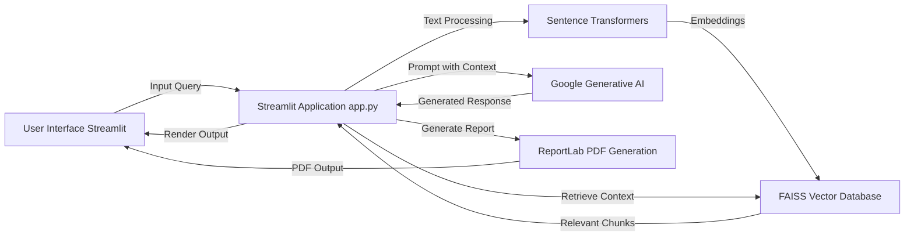
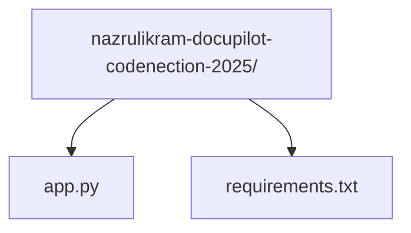

# Documentation for Docupilot

Track: Industry Collaboration

Problem Statement: Fix the Docs: Smarter, Faster, Maintainable Documentation for the Real World by iFAST


This document provides comprehensive technical documentation for the `Docupilot` project. It covers the project's purpose, architecture, setup instructions, usage, and key components.

This documentation was created using Docupilot.

## Table of Contents

1.  [Introduction](#1-introduction)
2.  [Features](#2-features)
3.  [Architecture](#3-architecture)
4.  [Setup and Installation](#4-setup-and-installation)
    *   [Prerequisites](#prerequisites)
    *   [Cloning the Repository](#cloning-the-repository)
    *   [Setting up the Environment](#setting-up-the-environment)
    *   [Installing Dependencies](#installing-dependencies)
    *   [Environment Variables](#environment-variables)
    *   [Running the Application](#running-the-application)
5.  [Usage](#5-usage)
6.  [Project Structure](#6-project-structure)
7.  [Dependencies](#7-dependencies)
8.  [Troubleshooting](#8-troubleshooting)
9.  [Contributing](#9-contributing)
10. [License](#10-license)

---

## 1. Introduction

The `Docupilot` project is an interactive web application designed to leverage the power of advanced AI models and vector databases for intelligent information processing and content generation. Built with Streamlit, it provides a user-friendly interface for interacting with Google's Generative AI models, facilitating tasks such as semantic search, content summarization, question answering, and the creation of structured reports.

The project's dependencies strongly indicate its core functionality revolves around Retrieval Augmented Generation (RAG) principles. It combines the ability to embed and efficiently search through large volumes of text (using `sentence-transformers` and `faiss-cpu`) with the generative capabilities of `google-generativeai` models, all presented via a `streamlit` interface, with an added capability for PDF report generation using `reportlab`.

## 2. Features

Based on the project's dependencies, the application likely offers the following key features:

*   **Interactive AI Assistant:** Engage with a Generative AI model for various queries and content generation tasks.
*   **Semantic Search:** Perform context-aware searches across a knowledge base by leveraging vector embeddings.
*   **Retrieval Augmented Generation RAG:** Enhance AI responses by retrieving relevant information from a predefined corpus.
*   **Content Summarization:** Generate concise summaries of input texts or retrieved documents.
*   **Question Answering:** Answer questions based on processed data, potentially with source attribution.
*   **Dynamic Content Generation:** Create various forms of text-based content, from drafts to creative writing.
*   **PDF Report Generation:** Export generated content or summaries into professional PDF documents.
*   **User-Friendly Interface:** An intuitive web interface built with Streamlit for easy interaction.

## 3. Architecture

The application follows a client-server architecture, where the Streamlit application acts as both the front-end and the orchestrator for backend AI and data processing services.

The high-level architecture can be visualized as follows:



**Key Architectural Components:**

*   **User Interface (Streamlit):** Provides the interactive web frontend where users can input queries, view AI-generated responses, and trigger actions like report generation.
*   **Streamlit Application (`app.py`):** The core logic that handles user input, orchestrates calls to various services, processes data, and renders output.
*   **Sentence Transformers:** Used for converting text into numerical vector embeddings, which capture the semantic meaning of the text.
*   **FAISS Vector Database:** An efficient library for similarity search. It stores the generated text embeddings and enables fast retrieval of semantically similar text chunks based on a query. This forms the "retrieval" part of RAG.
*   **Google Generative AI:** The large language model (LLM) service (e.g., Gemini) responsible for understanding the context provided (including retrieved information) and generating relevant, coherent, and creative text responses.
*   **ReportLab PDF Generation:** A library used to programmatically create PDF documents, enabling the application to export summaries or generated content into a professional report format.

## 4. Setup and Installation

Follow these steps to set up and run the `nazrulikram-docupilot-codenection-2025` application on your local machine.

### Prerequisites

*   Python 3.8 or higher
*   `pip` (Python package installer)
*   `git` (for cloning the repository)

### Cloning the Repository

First, clone the project repository to your local machine:

```bash
git clone https://github.com/nazrulikram/nazrulikram-docupilot-codenection-2025.git
cd nazrulikram-docupilot-codenection-2025
```

### Setting up the Environment

It's highly recommended to use a virtual environment to manage project dependencies.

```bash
# Create a virtual environment
python -m venv .venv

# Activate the virtual environment
# On macOS/Linux:
source .venv/bin/activate
# On Windows:
# .venv\Scripts\activate
```

### Installing Dependencies

Once the virtual environment is activated, install all required packages using `pip`:

```bash
pip install -r requirements.txt
```

### Environment Variables

The application requires an API key for Google's Generative AI services. You need to obtain a `GOOGLE_API_KEY` from the [Google AI Studio](https://aistudio.google.com/app/apikey).

Set this key as an environment variable before running the application:

**On macOS/Linux:**

```bash
export GOOGLE_API_KEY="YOUR_API_KEY_HERE"
```

**On Windows (Command Prompt):**

```bash
set GOOGLE_API_KEY="YOUR_API_KEY_HERE"
```

**On Windows (PowerShell):**

```bash
$env:GOOGLE_API_KEY="YOUR_API_KEY_HERE"
```

For persistent storage of environment variables in development, you might consider using a `.env` file and a library like `python-dotenv`, although it's not listed in `requirements.txt`. For simple local execution, setting it in your shell is sufficient.

### Running the Application

After all dependencies are installed and the environment variable is set, you can run the Streamlit application:

```bash
streamlit run app.py
```

This command will open the application in your default web browser, usually at `http://localhost:8501`.

## 5. Usage

Once the application is running and accessible in your browser, you can interact with it through the Streamlit interface.

1.  **Input Area:** Look for a text input box or a chat interface where you can type your queries, prompts, or text for processing.
2.  **Interaction Buttons:** There will likely be buttons to trigger actions such as "Submit", "Generate", "Summarize", or "Search".
3.  **Display Area:** The results of your interaction, such as AI-generated text or search results, will be displayed in a dedicated section of the application.
4.  **Report Generation:** If a PDF report generation feature is available, there will be a button or option to "Generate Report" or "Export to PDF". Clicking this will typically download a PDF file to your browser.
5.  **Configuration Options:** Depending on the implementation, there might be sidebars or settings to adjust parameters like model temperature, retrieval chunk size, or the specific AI model to use.

Experiment with different inputs to explore the full range of the application's capabilities, from asking questions to generating creative content or summarising documents.

## 6. Project Structure

The project has a straightforward directory structure:



*   **`nazrulikram-docupilot-codenection-2025/`**: The root directory of the project.
*   **`app.py`**: This is the main Python script containing the Streamlit application code. It defines the user interface, handles input, orchestrates calls to AI models and the FAISS database, and manages output rendering, including PDF generation.
*   **`requirements.txt`**: This file lists all the Python libraries and their versions required to run the application. `pip` uses this file to install the necessary dependencies.

## 7. Dependencies

The `requirements.txt` file specifies the following key dependencies:

*   **`numpy`**: (Numerical Python) A fundamental package for scientific computing with Python. It provides support for large, multi-dimensional arrays and matrices, along with a collection of high-level mathematical functions to operate on these arrays. Essential for numerical operations, especially with vector embeddings.
*   **`faiss-cpu`**: (Facebook AI Similarity Search) A library for efficient similarity search and clustering of dense vectors. It is crucial for building fast retrieval systems and vector databases, enabling the semantic search and RAG capabilities of the application. The `-cpu` variant indicates it uses CPU for computations.
*   **`requests`**: An elegant and simple HTTP library for Python. It is used for making HTTP requests to external services or APIs, though its specific use case within this project is not explicit, it's a common utility for fetching data or interacting with web services.
*   **`streamlit`**: An open-source app framework for Machine Learning and Data Science teams. It allows for quickly building and deploying interactive web applications directly from Python scripts, forming the user interface layer of this project.
*   **`reportlab`**: A powerful open-source Python library for creating PDF documents programmatically. This dependency indicates the application's capability to generate and export content, summaries, or reports into professional PDF formats.
*   **`sentence-transformers`**: A Python framework for state-of-the-art sentence, text and image embeddings. It is used to convert textual data into dense vector representations, which are then used by FAISS for similarity search.
*   **`google-generativeai`**: The official Python client library for Google's Generative AI models (e.g., Gemini). This is the core dependency for interacting with the large language models to perform generative tasks like text creation, summarization, and question answering.

## 8. Troubleshooting

*   **`GOOGLE_API_KEY` not set:**
    *   **Error:** The application might crash with an authentication error or a message indicating a missing API key.
    *   **Solution:** Ensure you have obtained a valid `GOOGLE_API_KEY` and set it as an environment variable as described in the [Environment Variables](#environment-variables) section before running `streamlit run app.py`.
*   **`ModuleNotFoundError`:**
    *   **Error:** "No module named 'some_package'"
    *   **Solution:** This typically means a required dependency is not installed. Make sure your virtual environment is activated and run `pip install -r requirements.txt` again to install all packages.
*   **Application not opening in browser:**
    *   **Error:** Streamlit starts, but the browser doesn't open, or the page is unreachable.
    *   **Solution:** Check the terminal output for the URL (e.g., `http://localhost:8501`). Manually navigate to this URL in your web browser. If it's still unreachable, check for firewall issues or port conflicts.
*   **Encoding error during `app.py` execution:**
    *   **Error:** If you attempt to *read* `app.py` directly and encounter an encoding error (like the one originally reported: `Error reading file with 'cp1252': 'charmap' codec can't decode byte 0x9d`), it suggests the file was saved with an unusual encoding.
    *   **Solution:** For *running* the Streamlit app, this might not directly manifest as an error if Python's default encoding can handle it. If `streamlit run app.py` fails due to this, the file might need to be re-saved with UTF-8 encoding. Text editors usually have an option to "Save As" with a different encoding.

## 9. Contributing

Contributions to the `nazrulikram-docupilot-codenection-2025` project are welcome! If you find a bug, have a feature request, or want to contribute code, please follow these general guidelines:

1.  **Fork the Repository:** Create your own fork of the project on GitHub.
2.  **Create a New Branch:** Branch off the `main` branch for your changes (e.g., `feature/my-new-feature` or `bugfix/issue-123`).
3.  **Make Your Changes:** Implement your bug fix or new feature.
4.  **Test Your Changes:** Ensure your changes do not introduce new issues and that existing functionalities still work correctly.
5.  **Commit Your Changes:** Write clear and concise commit messages.
6.  **Push to Your Fork:** Push your branch to your forked repository.
7.  **Submit a Pull Request:** Open a pull request against the `main` branch of the original repository, describing your changes in detail.

## 10. License

This project is licensed under the MIT License. See the `LICENSE` file (if present) in the repository for more details, or assume the following standard MIT license:

```
MIT License

Copyright (c) 2023 Nazrul Ikram (or Project Contributors)

Permission is hereby granted, free of charge, to any person obtaining a copy
of this software and associated documentation files (the "Software"), to deal
in the Software without restriction, including without limitation the the
rights to use, copy, modify, merge, publish, distribute, sublicense, and/or
sell copies of the Software, and to permit persons to whom the Software is
furnished to do so, subject to the following conditions:

The above copyright notice and this permission notice shall be included in all
copies or substantial portions of the Software.

THE SOFTWARE IS PROVIDED "AS IS", WITHOUT WARRANTY OF ANY KIND, EXPRESS OR
IMPLIED, INCLUDING BUT NOT LIMITED TO THE WARRANTIES OF MERCHANTABILITY,
FITNESS FOR A PARTICULAR PURPOSE AND NONINFRINGEMENT. IN NO EVENT SHALL THE
AUTHORS OR COPYRIGHT HOLDERS BE LIABLE FOR ANY CLAIM, DAMAGES OR OTHER
LIABILITY, WHETHER IN AN ACTION OF CONTRACT, TORT OR OTHERWISE, ARISING FROM,
OUT OF OR IN CONNECTION WITH THE SOFTWARE OR THE USE OR OTHER DEALINGS IN THE
SOFTWARE.
```
